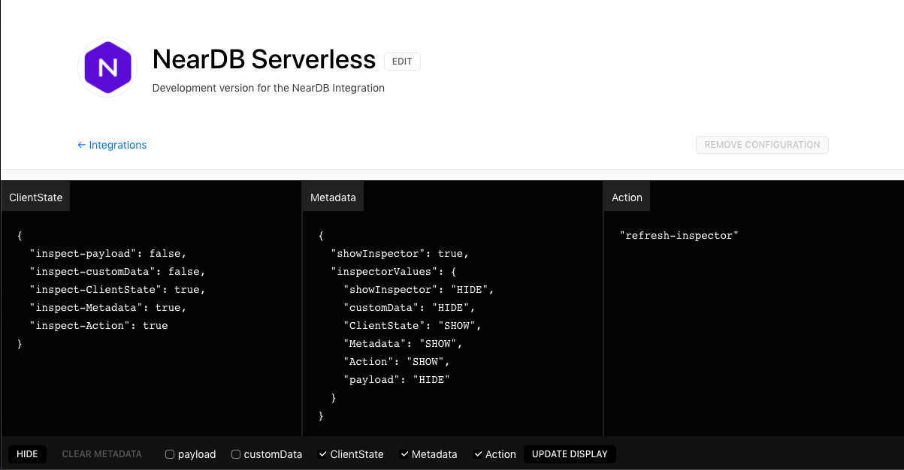

# zeit-integration-inspect

Quickly inspect values during Zeit Integrations development.



## Install

```bash
yarn add --dev zeit-integration-inspect
```

## Usage

```javascript
const inspectPanel = require("zeit-integration-inspect");

async function handler(options){
    return htm`
        <Page>
            <Container>
                <H2>Your Integration</H2>
                <P>Awesome description.</P>
            </Container>
            ${await inspectPanel(options, values)}
        </Page>
    `;
}

module.exports = withUiHook(handler);
```

**inspectPanel** accepts 2 parameters.

- **options** - values that are passed down from withUiHook middleware. i.e. *metadata, clientState, action and etc*.

- **values** - These are values you would like to display during development.
